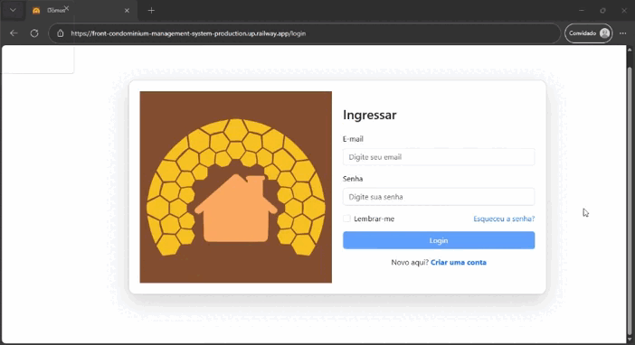

#### Usuários principais
- Síndico/Administração
- Morador
- Funcionários

#### Ideias iniciais
- Cadastro de moradores e apartamentos/unidades
- Comunicados internos
- Reserva de áreas comuns (salão de festas, churrasqueira, quadra)
- Registro de ocorrências (barulho, manutenção, segurança)
- Integração de notificações
- Controle de cobranças e condomínio
- Controle de ações por tipo de usuário, e segmentação de informações de acordo com seus níveis

#### Arquitetura e Tecnologias
- Linguagem Backend:
→ TypeScript e Node.js
- Banco de Dados:
→ PostgreSQL
- Frontend:
→ Angular, TypeScript
- Gerenciamento de Dependências:
→ npm
- Controle de Versão:
→ Git
- Containerização:
→ Docker
- Padrão de arquitetura utilizada: 
→ MVC

#### Protótipo:
[Figma](https://www.figma.com/design/qiWAbfyKnuKTYSzWLa6CdI/Condominium-Management-System?node-id=0-1&t=Wnft73GjivRkF9B3-1)

#### Estrutura dos diretórios:
```bash
Condominium-Management-System/
│
├── backend/
│   ├── src/
│   │   ├── app/
│   │   │   ├── controllers/
│   │   │   ├── entities/
│   │   │   ├── interfaces/
│   │   │   ├── middlewares/
│   │   │   ├── repositories/
│   │   │   ├── routes/
│   │   │   └── services/
│   │   └── database/
│   │       └── migrations/
│   ├── uploads/
│   ├── tests/
│   ├── Dockerfile
│   ├── package.json
│   ├── package-lock.json
│   └── tsconfig.json
│
├── frontend/
│   ├── src/
│   │   ├── app/
│   │   │   ├── components/
│   │   │   │   ├── header/
│   │   │   │   ├── sidebar/
│   │   │   │   └── footer/
│   │   │   ├── environments/
│   │   │   ├── pages/
│   │   │   │   ├── cadastro-cobrancas/
│   │   │   │   ├── cobrancas/
│   │   │   │   ├── encomendas/
│   │   │   │   ├── home/
│   │   │   │   ├── login/
│   │   │   │   ├── ocorrencias/
│   │   │   │   ├── painel/
│   │   │   │   ├── perfil/
│   │   │   │   ├── registro/
│   │   │   │   └── reservas/
│   │   │   ├── responses/
│   │   │   └── services/
│   │   │       └── auth/
│   │   ├── assets/
│   │   └── index.html
│   ├── Dockerfile
│   ├── angular.json
│   ├── package.json
│   ├── package-lock.json
│   └── tsconfig.json
│
├── docs/
├── docker-compose.yml
├── .gitignore
└── README.md
```

<p align="center">
  
</p>